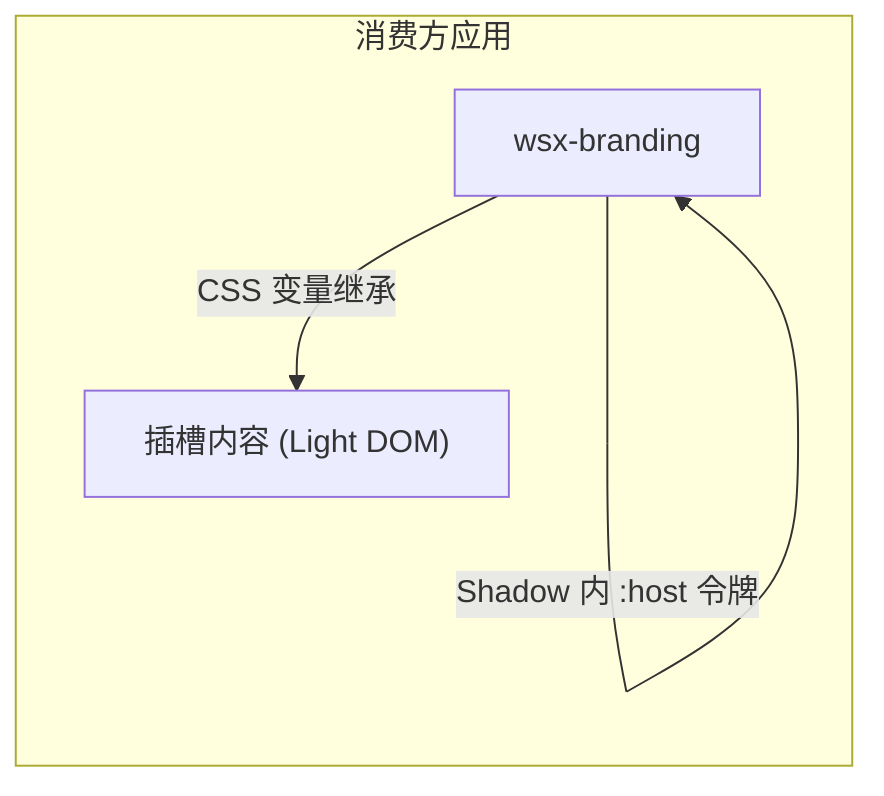
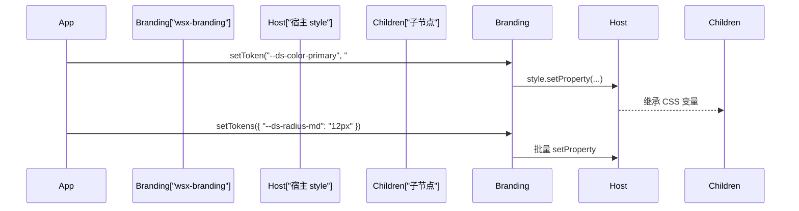

# RFC 0064: Theme 包与 wsx-branding 及覆盖 API

- **状态**: Draft
- **创建时间**: 2026-02
- **作者**: WSXJS Team
- **相关问题**: 设计系统 Web Component 化、品牌主题可覆盖

## 概述

将设计系统从「仅通过导入 CSS」升级为**主题包 + Web Component**：新增 `packages/theme`，提供 `wsx-branding` 作为设计令牌的载体；同时**暴露覆盖 API**，允许通过属性、CSS 或程序接口覆盖任意令牌，便于多品牌、白标或页面级定制。

## 标准品牌/组件设计（三层模型）

组件与主题的样式优先级采用统一的三层模型，**不应**把设计系统仅放在 site 的 `design-system/` 下由各页面直接引用；而应由**主题包**提供默认层，再通过 preset 与 API 覆盖：

| 层级 | 来源 | 说明 | 实现方式 |
|------|------|------|----------|
| **1. 默认主题** | 组件/主题包 | 提供默认令牌与组件样式，优先级最低 | 置于 `@layer theme-default`（或等价层），保证可被上层覆盖 |
| **2. Preset** | 主题预设 | 命名主题（如 wsxjs、minimal）覆盖默认值 | 通过加载预设 CSS 或 `wsx-branding` 的 preset 属性/类，写入一组变量 |
| **3. API 覆盖** | 属性 / 宿主 CSS / 程序接口 | 页面级或运行时覆盖，优先级最高 | 属性、页面选择器对 `wsx-branding` 设变量、或 `setToken` / `setTokens` |

效果：**默认（@layer）→ preset 覆盖默认 → API 覆盖 preset**。site 不作为设计系统定义的源头，仅消费 theme 包并通过 preset 或 API 做品牌定制。

## 问题陈述

### 观察到的行为

- 当前设计系统通过 `site/src/design-system/tokens.css` 提供令牌，站点通过 `@import` 引入。
- 令牌与文档/站点强绑定在构建与路径上，难以作为独立能力被其他应用或产品线复用。
- 若需覆盖主色、圆角等，只能改 CSS 文件或写更高特异性选择器，缺少**声明式或程序式**的覆盖入口。

### 根本原因

- 设计系统仅以「样式文件」形态存在，未以**组件 + API** 形态暴露，与「好的设计依赖 Web Component」的诉求不一致。
- 缺少统一的覆盖契约：谁可以覆盖、以何种方式（属性 / CSS / JS）、覆盖粒度（整主题 vs 单令牌）未定义。

## 目标

1. **主题包**：新增 `@wsxjs/wsx-theme`（或 `packages/theme`），提供 `wsx-branding`，用 Web Component 承载设计令牌，子节点通过继承获得 CSS 变量。
2. **不依赖 CSS 导入**：消费方通过挂载 `<wsx-branding>` 即可获得整套令牌，无需再 `@import` 设计系统 CSS（可选保留 CSS 作为回退或构建时引用）。
3. **覆盖 API**：支持三种覆盖方式——**属性**、**宿主 CSS**、**程序接口**，满足多品牌与白标需求。

## 解决方案

### 1. 主题包与组件形态

- **包名**：`@wsxjs/wsx-theme`，路径 `packages/theme`。
- **组件**：`wsx-branding`，继承 `WebComponent`，使用 Shadow DOM，内部仅包含：
  - 一份作用于 `:host` 的令牌样式（原始 + 语义 + 兼容层），使**插槽内容（Light DOM）**继承这些变量；
  - 一个默认插槽 `<slot></slot>`，用于包裹应用内容。
- **布局**：`:host { display: contents; }`，组件不参与布局，仅提供令牌继承。



### 2. 覆盖 API 设计

覆盖能力分三层，**优先级从低到高**：默认令牌 &lt; 属性 / 宿主 CSS &lt; 程序接口（同一令牌上后设者优先）。

#### 2.1 属性覆盖（Attribute Override）

用于常见、语义明确的令牌，便于在 HTML 或模板中声明式覆盖。

| 属性名 | 类型 | 说明 | 映射令牌示例 |
|--------|------|------|--------------|
| `data-theme` | `"light"` \| `"dark"` \| `"auto"` | 主题模式 | 切换语义色（背景/文字/边框等） |
| `data-primary` | 颜色字符串 | 主色 | `--ds-color-primary`, `--primary-red` 等 |
| `data-primary-hover` | 颜色字符串 | 主色悬停 | `--ds-color-primary-hover` |
| `data-accent` | 颜色字符串 | 强调色 | `--ds-color-accent` |
| `data-radius` | 长度（如 `8px`） | 默认圆角 | `--ds-radius-md` |

- 组件在 `connectedCallback` / `attributeChangedCallback` 中读取上述属性，并调用 `this.style.setProperty('--ds-color-primary', value)` 等写入宿主，子节点自动继承。
- 未设置的属性不写入，保持默认令牌值。

#### 2.2 宿主 CSS 覆盖（Host CSS Override）

允许页面或全局样式通过选择器直接覆盖组件宿主上的变量，适合大量或复杂覆盖。

```css
/* 页面或应用样式：针对主题宿主覆盖 */
wsx-branding {
    --ds-color-primary: #2563eb;
    --ds-color-accent: #f59e0b;
    --ds-radius-md: 0.75rem;
}
```

- 无需改组件代码，仅需约定「选择器为 `wsx-branding`（或带 class/part）」。
- 与属性覆盖可并存：若同时设置属性与 CSS，由层叠决定（通常后加载的 CSS 或更高特异性胜出）。

#### 2.3 程序接口覆盖（Programmatic Override API）

供脚本在运行时动态覆盖任意令牌，适合主题切换、A/B 测试、用户自定义主题等。

```typescript
// 暴露在元素上的方法
interface WsxBrandingElement extends HTMLElement {
    /** 设置单个令牌值，支持任意 --ds-* 或兼容层变量名 */
    setToken(name: string, value: string): void;
    /** 批量设置令牌 */
    setTokens(tokens: Record<string, string>): void;
    /** 清除之前通过 setToken/setTokens 设置的覆盖（恢复为默认或属性/CSS 决定的值） */
    clearOverrides(): void;
    /** 可选：获取当前某令牌的解析值（用于调试或同步） */
    getToken(name: string): string | null;
}
```

- `setToken` / `setTokens` 内部对宿主执行 `this.style.setProperty(name, value)`，子节点继承。
- `clearOverrides()` 可清除通过 JS 设置的属性（例如维护一个 Set 记录程序设置的变量名，清除时逐个 `this.style.removeProperty(name)`），不影响属性或外部 CSS。



### 3. 与文档/站点集成

- **站点**：根布局用 `<wsx-branding>` 包裹应用内容，移除对 `design-system/tokens.css` 的 `@import`；如需覆盖，使用属性或页面 CSS 或脚本调用 `setToken` / `setTokens`。
- **文档（wsx-press）**：可在文档根同样包裹 `wsx-branding`，或继续使用现有 `theme.css` 并保持与设计系统主色一致（如通过 `var(--ds-color-primary, #dc2626)`）；两种方式可并存。

### 4. 主题同步（data-theme）

- `wsx-branding` 可**同步文档根的主题状态**：监听 `<html>` 的 `class` 或 `data-theme`（与 `wsx-theme-switcher` 行为一致），将当前有效主题（light/dark/auto）反映到自身的 `data-theme` 属性上，使 Shadow 内 `:host([data-theme="dark"])` 等选择器生效。
- 若消费方通过属性显式设置 `data-theme`，则以组件自身属性为准，不随文档覆盖（或约定「文档根优先」并在文档中说明）。

## 技术细节

### 覆盖优先级（同一变量）

与三层模型一致：默认（@layer）→ preset → API。

| 优先级 | 来源 | 说明 |
|--------|------|------|
| 1（最低） | 组件内默认主题（`@layer theme-default`） | `:host` 默认令牌，未覆盖时的默认值 |
| 2 | Preset | 预设主题（如 wsxjs）加载的 CSS 或变量集，覆盖默认层 |
| 3 | 宿主上的外部 CSS | 页面样式表对 `wsx-branding` 的规则 |
| 4 | 组件属性 | `data-primary` 等经组件逻辑写入 `style` |
| 5（最高） | 程序 API | `setToken` / `setTokens` 写入 `style` |

同一变量后设置的 `style` 会覆盖先前的（符合层叠规则）；若需「仅用 API 覆盖、不受 CSS 影响」，可在文档中说明约定（例如 API 使用 `setProperty(..., 'important')` 的注意点，或建议将覆盖集中在一处）。

### 属性与令牌映射表（示例）

| 属性 | 写入的 CSS 变量 |
|------|-----------------|
| `data-primary` | `--ds-color-primary`, `--primary-red`, `--btn-primary-bg`, `--hero-gradient-start` 等 |
| `data-primary-hover` | `--ds-color-primary-hover`, `--secondary-red`, `--btn-primary-hover` |
| `data-accent` | `--ds-color-accent`, `--accent-orange`, `--hero-gradient-end` |
| `data-radius` | `--ds-radius-md`, `--wsx-theme-btn-border-radius`, `--wsx-theme-card-border-radius` |

实现时可按「主色 / 强调色 / 圆角」等分组，减少重复书写。

### 文件与包结构（建议）

```
packages/theme/
├── package.json
├── tsconfig.json
├── vite.config.ts
├── src/
│   ├── index.ts              # 导出组件与类型
│   ├── WsxBranding.wsx  # 组件实现
│   ├── tokens-host.css       # :host 令牌（原始+语义+兼容）
│   └── types.ts              # WsxBrandingElement 等
```

## 验证

### 测试用例

| 场景 | 预期行为 | 状态 |
|------|----------|------|
| 仅挂载 `<wsx-branding>`，无覆盖 | 子节点继承默认深红橘色与间距等令牌 | 待实现 |
| 设置 `data-theme="dark"` | 宿主应用暗色语义令牌，子节点为暗色 | 待实现 |
| 设置 `data-primary="#2563eb"` | 宿主与子节点主色为 #2563eb | 待实现 |
| 页面 CSS 对 `wsx-branding` 设置 `--ds-color-primary` | 子节点使用该覆盖值 | 待实现 |
| 调用 `el.setToken('--ds-color-primary', 'red')` | 子节点主色为 red | 待实现 |
| 调用 `el.clearOverrides()` | 程序设置的覆盖被移除，恢复为默认或属性/CSS 值 | 待实现 |
| `:host { display: contents }` | 组件不占布局空间，子节点布局与未包一层时一致 | 待实现 |

## 与 WSX 理念的契合度

- **Web Component 优先**：设计系统以组件形态提供，符合「好的设计依赖 Web Component」。
- **可覆盖性**：通过属性、CSS、JS 三种 API 暴露覆盖能力，便于多品牌与白标，且不破坏封装。
- **信任浏览器**：依赖标准 CSS 变量继承与 Shadow DOM，无额外运行时抽象。

## 未解决问题

1. 是否在首版支持 `data-radius` / `data-accent` 等除主色外的属性，还是仅 `data-theme` + 主色，其余一律用 CSS 或 `setToken` 覆盖？
2. `clearOverrides()` 是否仅清除「由 setToken/setTokens 设置的变量」，是否需区分「恢复为默认」与「恢复为属性/CSS 指定值」？
3. 文档站（wsx-press）是否默认依赖 `wsx-branding`，还是保持当前 CSS 变量引用并可选挂载组件？

## 实现计划（建议）

1. **阶段 1**：新增 `packages/theme`，实现 `wsx-branding`（仅默认令牌 + `data-theme` 同步），无覆盖 API。
2. **阶段 2**：实现属性覆盖（`data-primary`、`data-primary-hover`、`data-accent` 等）与宿主 CSS 覆盖约定。
3. **阶段 3**：实现 `setToken` / `setTokens` / `clearOverrides`（及可选 `getToken`），并更新文档与站点集成方式。
