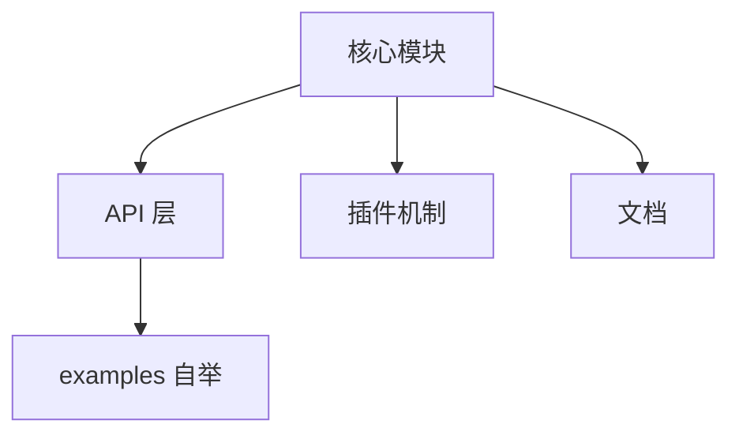

# WSX 框架个人开发者阶段推进模板

本模板适用于个人独立开发者推进框架级项目，强调“最小可用、阶段性目标、自动化、文档驱动”，助力高效自我管理与长期演进。

---

## 1. 愿景与路线图（1-2天）
### Checklist
- [ ] 明确框架目标与定位
- [ ] 梳理目标用户与核心场景
- [ ] 列出核心特色与创新点
- [ ] 明确暂不做/非目标内容
- [ ] 制定初步路线图（可用 markdown checklist）
- [ ] 保存为 docs/WSX_VISION.md

#### 路线图模板示例
```markdown
# WSX 框架路线图
- [ ] MVP 核心功能
- [ ] Examples 自举验证
- [ ] 文档与开发体验
- [ ] 自动化测试与 CI
- [ ] 插件/扩展点预留
- [ ] 社区/生态建设（后置）
```

---

## 2. 核心架构与 API 设计（3-7天）
### Checklist
- [ ] 绘制核心模块架构图（可用 mermaid）
- [ ] 设计类型系统与主 API
- [ ] 明确扩展点与插件机制
- [ ] 为每个核心模块写注释与类型定义
- [ ] 保存为 docs/WSX_ARCH.md

#### 架构图模板（Mermaid）


---

## 3. Examples 自举与端到端验证（持续迭代）
### Checklist
- [ ] 新功能开发前先写/补充 examples 场景
- [ ] 每个核心能力都要有 examples 组件覆盖
- [ ] 端到端用例（如 Playwright/Puppeteer）
- [ ] examples 目录结构清晰，注释完善
- [ ] 每次主线变更后手动/自动回归验证

#### Examples 组件模板
```tsx
// MyFeatureExample.wsx
import { WebComponent, autoRegister } from '@wsxjs/wsx-core';
@autoRegister()
export class MyFeatureExample extends WebComponent {
  render() {
    return <div>My Feature Example</div>;
  }
}
```

---

## 4. 文档与开发体验（同步进行）
### Checklist
- [ ] 每个核心 API/模块有注释
- [ ] README/快速上手文档同步更新
- [ ] 关键用法有代码示例
- [ ] FAQ/常见问题文档
- [ ] 保存为 docs/WSX_API.md、docs/WSX_FAQ.md 等

#### API 文档模板
```markdown
# MyFeature API
- **功能**：简要描述
- **用法**：
```ts
import { MyFeature } from '@wsxjs-core';
MyFeature.doSomething();
```
- **参数说明**：
| 参数 | 类型 | 说明 |
| ---- | ---- | ---- |
| ...  | ...  | ...  |
```

---

## 5. 自动化测试与 CI（可选，建议最小化）
### Checklist
- [ ] 配置最小可用 jest/ts-jest
- [ ] 每个核心模块有单元测试
- [ ] examples 有端到端测试
- [ ] 配置 GitHub Actions/CI 脚本
- [ ] 保存为 .github/workflows/ci.yml

#### GitHub Actions CI 脚本模板
```yaml
name: CI
on: [push, pull_request]
jobs:
  build-test:
    runs-on: ubuntu-latest
    steps:
      - uses: actions/checkout@v3
      - uses: pnpm/action-setup@v2
        with:
          version: 8
      - run: pnpm install
      - run: pnpm build
      - run: pnpm test
      - run: pnpm lint
```

---

## 6. 生态/社区/扩展点（后置，预留即可）
### Checklist
- [ ] 核心架构中预留插件/扩展接口
- [ ] 关键扩展点有 TODO 注释
- [ ] 未来规划文档持续补充
- [ ] 保存为 docs/WSX_ECOSYSTEM.md

#### 扩展点注释模板
```ts
// TODO: 插件机制预留，未来支持自定义渲染器
export interface Plugin {
  // ...
}
```

---

## 阶段推进建议
- 每阶段 checklist 可直接复制到 issues/PR/个人任务管理工具
- 阶段结束后，记录实际完成内容、遗留问题、下阶段计划
- 所有文档/路线图/计划建议直接保存在 docs/ 目录，便于长期追踪
- 充分利用自动化工具（格式化、测试、CI），减少重复劳动

---

（本模板由 AI 自动生成，适合个人开发者高效推进框架项目，后续可根据实际情况灵活调整） 
