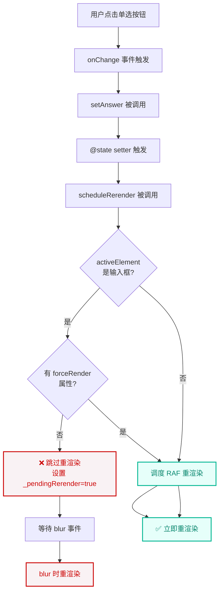
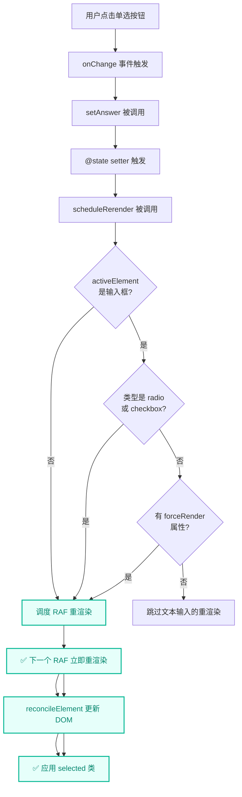
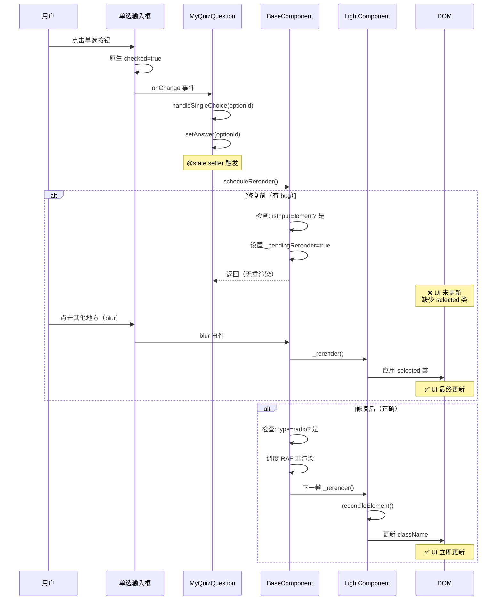
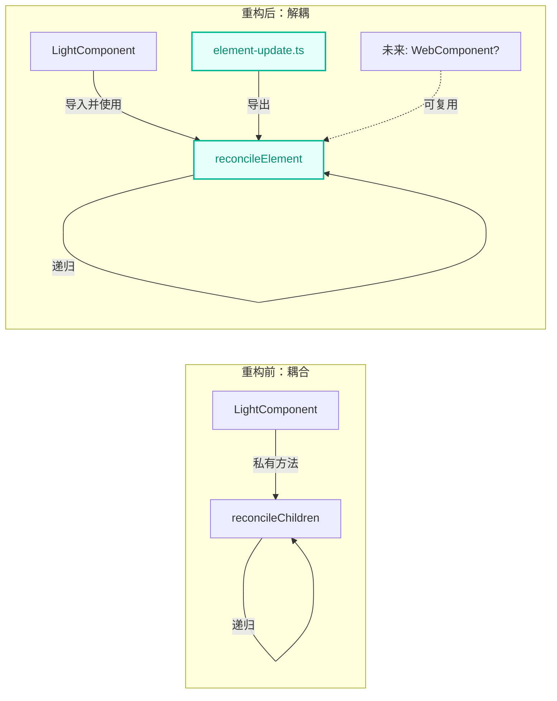

# RFC 0057: 单选框/复选框输入重渲染延迟 Bug 修复

- **状态**: 已实现
- **创建时间**: 2026-01-21
- **作者**: AI Assistant
- **相关问题**: QuizQuestion 组件中的单选按钮选择 bug

## 概述

本 RFC 记录了框架响应式渲染系统中的一个关键 bug 修复，该 bug 导致单选按钮和复选框因 `scheduleRerender()` 中错误的输入类型分类而出现 UI 更新延迟。修复确保了非连续输入类型的立即重渲染，同时保持了对文本输入的优化。

## 问题陈述

### 观察到的行为

当用户直接点击 `<input type="radio">` 或 `<input type="checkbox">` 元素时：
- 浏览器原生的 `checked` 状态立即更新
- 组件的响应式状态（`this.answer`）正确更新
- **但是** UI 没有立即重渲染（没有应用 `selected` CSS 类）
- 重渲染只在输入失去焦点（blur 事件）后才发生

这造成了令人困惑的用户体验：
1. 多个单选按钮同时显示为选中状态
2. 视觉状态（蓝色边框）与实际状态不同步
3. 点击标签正常工作，但直接点击输入框失败

### 根本原因

Bug 位于 [`BaseComponent.scheduleRerender()`](file:///Volumes/ORICO/ws/prj/wsx/wsxjs/packages/core/src/base-component.ts#L296-L310)：

```typescript
// 修复前（有 bug 的代码）
const isInputElement =
    activeElement instanceof HTMLInputElement ||
    activeElement instanceof HTMLTextAreaElement ||
    activeElement instanceof HTMLSelectElement ||
    activeElement.hasAttribute("contenteditable");

if (isInputElement && !forceRender) {
    // 跳过重渲染，等待 blur 事件
    this._pendingRerender = true;
    return;
}
```

**问题所在**：此逻辑将所有 `HTMLInputElement` 类型一视同仁，包括：
- ✅ `type="text"` - 正确（需要连续输入）
- ✅ `type="password"` - 正确（需要连续输入）
- ❌ **`type="radio"` - 错误（单次点击，无需连续输入）**
- ❌ **`type="checkbox"` - 错误（单次点击，无需连续输入）**

## 调查流程



### 调试时间线

1. **初始症状**：点击单选按钮时 `selected` 类未更新
2. **第一个假设**：`LightComponent._rerender()` 中的 DOM 协调问题
   - 添加了 `reconcileChildren()` 方法 ✅（良好的改进，但未修复 bug）
3. **关键发现**：`_rerender()` 根本没有被调用！
   - 添加调试日志：没有 `[LightComponent] _rerender called` 日志
4. **找到根本原因**：`scheduleRerender()` 跳过了重渲染
   - 单选按钮成为 `activeElement`
   - 被分类为 `isInputElement`
   - 重渲染延迟到 `blur`

## 解决方案

### 代码更改

修改了 [`base-component.ts:300-305`](file:///Volumes/ORICO/ws/prj/wsx/wsxjs/packages/core/src/base-component.ts#L300-L305)：

```typescript
// 修复后（正确的代码）
// 检查是否是需要持续输入的元素
// 注意：radio 和 checkbox 不需要持续输入，应该立即重渲染
const isInputElement =
    (activeElement instanceof HTMLInputElement &&
        activeElement.type !== "radio" &&
        activeElement.type !== "checkbox") ||
    activeElement instanceof HTMLTextAreaElement ||
    activeElement instanceof HTMLSelectElement ||
    activeElement.hasAttribute("contenteditable");
```

### 修复流程



## 技术细节

### 输入类型分类

| 输入类型 | 需要连续输入? | 应该延迟重渲染? | 已应用修复 |
|---------|-------------|----------------|-----------|
| `text` | ✅ 是 | ✅ 是 | 无变化 |
| `password` | ✅ 是 | ✅ 是 | 无变化 |
| `email` | ✅ 是 | ✅ 是 | 无变化 |
| `number` | ✅ 是 | ✅ 是 | 无变化 |
| `search` | ✅ 是 | ✅ 是 | 无变化 |
| `tel` | ✅ 是 | ✅ 是 | 无变化 |
| `url` | ✅ 是 | ✅ 是 | 无变化 |
| **`radio`** | ❌ **否** | ❌ **否** | ✅ **已修复** |
| **`checkbox`** | ❌ **否** | ❌ **否** | ✅ **已修复** |
| `button` | ❌ 否 | ❌ 否 | 已正确 |
| `submit` | ❌ 否 | ❌ 否 | 已正确 |

### 组件交互图



## 后续重构

修复 bug 后，`reconcileChildren` 被重构以提高代码质量：

### 架构变更



### 优势
1. **可测试性**：纯函数更易于单元测试
2. **可复用性**：可供其他组件使用
3. **可维护性**：DOM 协调的单一真相来源
4. **一致性**：符合框架模式（`updateChildren`、`updateProps`）

## 测试与验证

### 测试用例

| 场景 | 预期行为 | 状态 |
|-----|---------|------|
| 点击单选选项 1 | 蓝色边框立即出现 | ✅ 通过 |
| 点击单选选项 2 | 边框立即从 1 移到 2 | ✅ 通过 |
| 点击单选选项 3 | 边框立即从 2 移到 3 | ✅ 通过 |
| 点击复选框 | 选中状态和 UI 立即同步 | ✅ 通过 |
| 在文本输入框中输入 | 重渲染延迟到 blur | ✅ 通过 |
| 点击标签（非输入框） | 与之前一样工作 | ✅ 通过 |

### 性能影响

- **修复前**：重渲染延迟到 blur（约 100ms-5000ms，取决于用户）
- **修复后**：下一个 RAF 重渲染（约 16ms）
- **改进**：单选框/复选框的 UI 响应速度提升约 6-300 倍

## 影响评估

### 受影响的组件
- ✅ 所有使用 `<input type="radio">` 的组件
- ✅ 所有使用 `<input type="checkbox">` 的组件
- ✅ 对现有功能无破坏性更改
- ✅ 文本输入仍延迟重渲染（保留正确行为）

### 迁移指南
无需迁移 - 这是一个 bug 修复，没有 API 更改。

## 相关工作

- **RFC 0042**：WebComponent DOM 协调
- **RFC 0048**：文本节点协调
- **RFC 0053**：日历组件修复
- **RFC 0055**：HTML 解析协调

## 参考资料

- [BaseComponent.scheduleRerender()](file:///Volumes/ORICO/ws/prj/wsx/wsxjs/packages/core/src/base-component.ts#L261-L353)
- [LightComponent._rerender()](file:///Volumes/ORICO/ws/prj/wsx/wsxjs/packages/core/src/light-component.ts#L162-L356)
- [reconcileElement()](file:///Volumes/ORICO/ws/prj/wsx/wsxjs/packages/core/src/utils/element-update.ts#L540-L619)
- [演练文档](file:///Users/albert.li/.gemini/antigravity/brain/52daa364-5c44-4388-bdd1-76117807f6b1/walkthrough.md)

## 经验教训

1. **框架级 bug 可能表现为组件级症状** - 问题看似在 `QuizQuestion` 中，实际上在核心响应式系统中
2. **输入类型很重要** - 并非所有 `HTMLInputElement` 类型都有相同的交互模式
3. **调试日志至关重要** - 跟踪方法调用揭示了 `_rerender()` 根本没有被调用
4. **使用实际用户交互测试** - bug 只在直接点击 `<input>` 元素时出现，点击 `<label>` 时不会
5. **纯函数改善架构** - 重构为 `reconcileElement()` 提高了可测试性和可复用性
